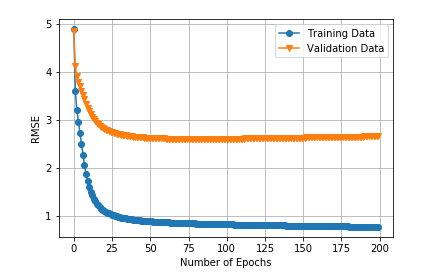

  

      <ul class="nav">
          <li><a href="{{ BASE_PATH }}/assets/Wang_Peiyu_cv.pdf">cv</a></li>
          <li><a href="https://github.com/oliviapy960825">github</a></li>
          <li><a href="https://www.linkedin.com/in/peiyu-w-a2a804126/">LinkedIn</a></li>
      </ul>
  

### Portfolio

<table class="wide">
<tr>
  <td class="left">
    
  </td>
  <td class="right">
    
  </td>
</tr>
<tr>
  <td class="left">
    
  </td>
  <td class="right">
    
  </td>
</tr>
</table>

  

      <ul class="nav">
          <li><a href="morefigs.html">see more figures</a></li>
      </ul>
  

