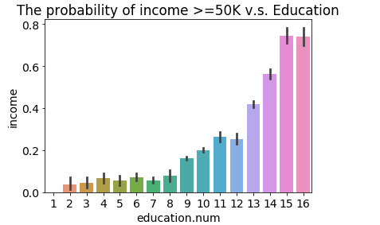

  

      <ul class="nav">
          <li><a href="pic_2.html">next</a></li>
      </ul>
  

[Feature Histogram](https://realpython.com/python-histograms/)
 A histogram is a great tool for quickly assessing a probability distribution that is intuitively understood by almost any audience.

[]  
[Feature Histogram Example Code](https://github.com/oliviapy960825/oliviapy960825.github.io/blob/master/Assignments/Programming%20for%20Analytics/project/Project-Logistic%20Regression.ipynb)
