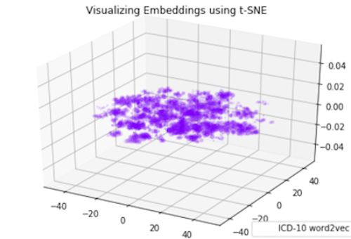

  

      <ul class="nav">
          <li><a href="pic_1.html">prev</a></li>
          <li><a href="pic_3.html">next</a></li>
      </ul>
  

[PCA & LDA 2D Projection](https://scikit-learn.org/stable/auto_examples/decomposition/plot_pca_vs_lda.html)
Using Iris Dataset as the example, the Iris dataset represents 3 kind of Iris flowers (Setosa, Versicolour and Virginica) with 4 attributes: sepal length, sepal width, petal length and petal width.

Principal Component Analysis (PCA) applied to this data identifies the combination of attributes (principal components, or directions in the feature space) that account for the most variance in the data. Here we plot the different samples on the 2 first principal components.

Linear Discriminant Analysis (LDA) tries to identify attributes that account for the most variance between classes. In particular, LDA, in contrast to PCA, is a supervised method, using known class labels.

