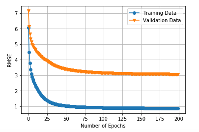
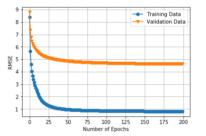
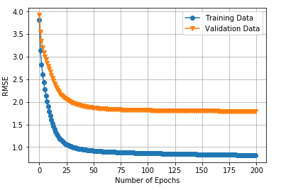
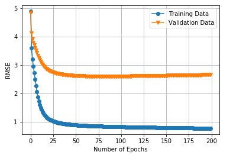

  

      <ul class="nav">
          <li><a href="pic_2.html">prev</a></li>
          <li><a href="pic_12.html">next</a></li>
      </ul>
  

[Recommender Systems](https://en.wikipedia.org/wiki/Recommender_system)
A recommender system or a recommendation system (sometimes replacing "system" with a synonym such as platform or engine) is a subclass of information filtering system that seeks to predict the "rating" or "preference" a user would give to an item. They are primarily used in commercial applications.

[Stochastic Gradient Descent](https://en.wikipedia.org/wiki/Stochastic_gradient_descent)
Stochastic gradient descent (often shortened to SGD), also known as incremental gradient descent, is an iterative method for optimizing a differentiable objective function, a stochastic approximation of gradient descent optimization.

[Fractional Stochastic Gradient Descent](https://doi.org/10.1007/s12525-018-0297-2) 
Proposed in Fractional stochastic gradient descent for recommender systems
(Khan, Z.A., Chaudhary, N.I. & Zubair, S. Electron Markets (2018))
Fractional calculus deals with integrals and derivatives that are of non-integer order.
The fractional order variation in standard SGD substantially improves the speed and accuracy for providing better recommendations.
FSGD is significantly different from the standard one because of the following salient features of fractional adaptive methods.
1. Fractional adaptive methods (i.e., FSGD) have the ability to adapt the scheme variables of rigid systems more precisely because they are built on the complex mathematical grounds of fractional calculus.
2. To control the convergence of adaptive methods, fraction- al adaptive algorithms offer more control parameters than other standard algorithms, e.g., FSGD provides μ, μfr (two learning rate parameters) and fr (fractional order parameter).
3. The fractional adaptive algorithms (i.e., FSGD) are more flexible in terms of design procedure, which are built either by applying fractional integrals or fractional derivatives for adaptation techniques.
4. Fractional techniques (i.e., FSGD) cover wide applicability range. They are applicable for both nonlinear and linear systems.

[] 
[]  
[]]  
[]]  
[Code Implementation](https://github.com/oliviapy960825/oliviapy960825.github.io/blob/master/Assignments/Design%20and%20Analysis%20of%20Algorithms/SGD%20and%20FSGD%20for%20Recommender%20Systems%20Code%20Implementation.ipynb)
