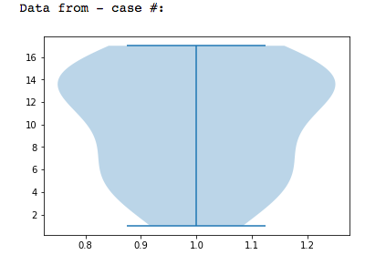
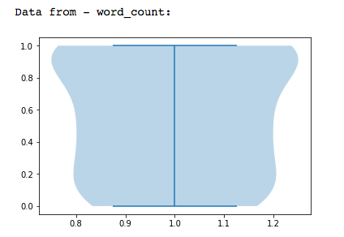
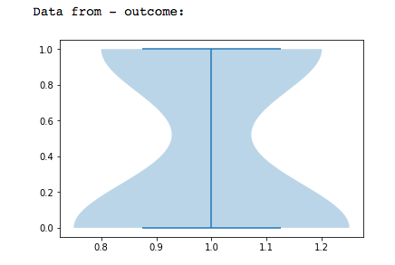
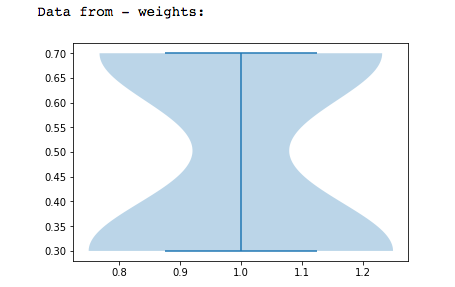

  

      <ul class="nav">
          <li><a href="pic_2.html">prev</a></li>
          <li><a href="pic_12.html">next</a></li>
      </ul>
  

[Violin Plot](https://en.wikipedia.org/wiki/Violin_plot)
A violin plot is a method of plotting numeric data. It is similar to a box plot with a rotated kernel density plot on each side.[1]

A violin plot has four layers. The outer shape represents all possible results, with thickness indicating how common. (Thus the thickest section represents the mode average.) The next layer inside represents the values that occur 95% of the time. The next layer (if it exists) inside represents the values that occur 50% of the time. The central dot represents the median average value.

[] (https://github.com/oliviapy960825/oliviapy960825.github.io/blob/master/Assignments/6992_Project.ipynb)
[] (https://github.com/oliviapy960825/oliviapy960825.github.io/blob/master/Assignments/6992_Project.ipynb)
[] (https://github.com/oliviapy960825/oliviapy960825.github.io/blob/master/Assignments/6992_Project.ipynb)
[] (https://github.com/oliviapy960825/oliviapy960825.github.io/blob/master/Assignments/6992_Project.ipynb)
